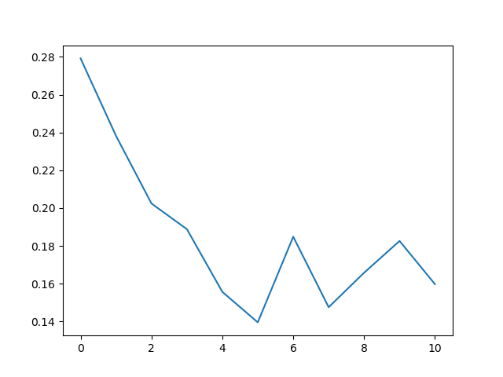
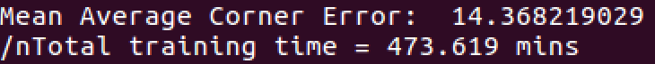

# Deep_Homography
This project is keras implementtion of <a href="https://arxiv.org/pdf/1606.03798.pdf">Deep Image Homography Estimation</a> paper by DeTone, Malisiewicz and Rabinovich. In the paper the introduced two networks for training, this focused on the implementation of the Regresion Network.
## The Dataset
To generate the dataset used in the paper, download the the <a href="http://cocodataset.org/#download">MSCOCO dataset</a>[train2014, val2014, test2014]. Then run the python data generator codes found in the data_generator folder.
<table style="width:100%">
  <tr>
    <th>Dataset Generated</th>
    <th>Number of image pairs</th>
    <th>Samples per image</th>
  </tr>
  <tr>
    <td>Training</td>
    <td>505,600</td>
    <td>8</td>
  </tr>
  <tr>
    <td>Validation</td>
    <td>6400</td>
    <td>8</td>
  </tr>
  <tr>
    <td>Testing</td>
    <td>5000</td>
    <td>1</td>
  </tr>
</table>

## Training
Run deephomographynet.py(make sure you have already generated the training and validation data). The training was done in a single GTX 980 Ti GPU for about 8 hours with a total number of 94800 iterations with 64 image pairs per iteration as the batch size. Stochastic gradient descent (SGD) with momentum of 0.9(same as the paper) was used with base learning rate of 0.005 and decreases by a factor of 10 every 31600 iterations or 1 epoch. Since the network is a regresion network, mean_square_error was used as the loss function for the model. The pre-trained model can be loaded using the saved files in.

<table style="width:100%">
  <tr>
    <td>Total params:</td>
    <td>34,195,336</td>
  </tr>
  <tr>
    <td>Trainable params:</td>
    <td>34,193,800</td>
  </tr>
  <tr>
    <td>Non-trainable params:</td>
    <td>1,536</td>
  </tr>
</table>

### Loss with respect to training epoch

## Test Result
In the testing, 5000 image pairs were randomly generated from the test2014 MSCOCO dataset. Mean Corner Error = 14.39 pixels (image size is 320 x240).

